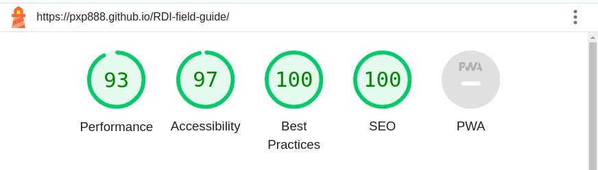

  

  

# Rainforest Distillers, Inc.

[Site Page](https://pxp888.github.io/RDI-field-guide/)

## Table of Contents

*   [__what is it - Field guide for potential investors__](#what-is-it---field-guide-for-potential-investors)
*   [__Design__](#design)
*   [__Features__](#features)
    * [Header](#header)
    * [Homepage](#homepage)
    * [Introduction, Marketing Direction, and Branding Pages](#introduction-marketing-direction-and-branding-pages)
    * [Contact page](#contact-page)
    * [Footer](#footer)
    * [Screen Size considerations](#screen-size-considerations)
*   [__Credit and Sources used__](#credit-and-sources-used)
    * ["Love Running" example code](#love-running-example-code)
    * [Site Design source material](#site-design-source-material)
*   [__Technologies Used__](#technologies-used)
*   [__Frameworks, Libraries & Programs Used__](#frameworks-libraries--programs-used)
*   [__Validation & Testing__](#validation--testing)
    * [HTML](#html)
    * [CSS](#css)
    * [Lighthouse report results](#lighthouse-report-results)
        * [Performance Issues](#performance-issues)
        * [Accessibility Issues](#accessibility-issues)
*   [__Deployment__](#deployment)
    * [Forking the GitHub Repository](#forking-the-github-repository)
    * [Local Clone](#local-clone)

 

## what is it - Field guide for potential investors

  

This website is an online version of a pitch document we created in 2018 for a startup rum distillery, which has been a growing project since 2013.

  

We were seeking funding at the time, and prepared several documents to support that, but we did not create any online resources at that time.

  

Hopefully that will change in the future!

  

___(Update : The company is in production, and the first batch of rum will be bottled in late 2023!)___

  

The website is a obviously a work-in-progress, but will improve as I do.

_(disclosure: I am one of the partners in this distillery.)_

# Design
The site has a consistent color theme that is a tinted monotone with a single highlight color.  The original document that inspired the site design has a monochromatic color scheme.  This worked very well on paper, but was not as effective on a screen. For this reason I added a single highlight color to the site.

Otherwise, font and layout choices were largely inspired by the original document.  Below are some images from the original document to demonstrate.  

_Original Cover_

_Original Table of Contents_

_Original Content Sample_

All photos used for the site also came from the original document. 

# Features
There are four static site pages, Home, Introduction, Marketing Direction, and Branding. 
Lastly there is a contact page for receiving messages.  

## Header
There is a consistent header at the top of each page.  This shows the company name and logo at the top, and a navigation bar below that.  
The navigation links react to mouse hovering, and the current page is indicated by a highlight color with partial opacity.  

*For example, the image above shows the header when looking at the contact page of the site.*

## Homepage
The homepage is largely a single image, which has a slow zoom effect (taken from the "love running" example website).  
There are some short textual descriptions of the product.  

## Introduction, Marketing Direction, and Branding Pages

These are all static pages with relevant information presented.  

## Contact page
The final site page is a contact page for receiving messages.  

## Footer
Lastly, we have a consistent footer throughout the site.  This simply shows social media links, along with a copyright notice.  

# Screen Size considerations
The majority of the site responsiveness is provided by using flexbox containers.  With the correct wrapping and sizing, the majority of the site is responsive and fluid.  

There are still some changes implemented through media querries for smaller screens. The main change is that two-column layouts are changed to single column layouts on certain pages.

# Credit and Sources used
### "Love Running" example code
The code for the display of images, and the captioning on top of them was inspired by the "Love Running" example code from Code Institute.  

The contact form was also inspired by the "Love Running" example code.

### Site Design source material
The source material for the site was from a PDF document created by Marc Schulze, the general manager of Rainforest Distillery, Inc.  I did have personal input on the original document, but the vast majority of the content and credit for said content is due to Marc Schulze.  

This site was created with his permission and support.  

## Technologies Used

* HTML5
* CSS3
 

## Frameworks, Libraries & Programs Used

|**Name**|**Description**|
|:-----|:-----|
|VSCode|Code editor|
|Git |Version control|
|GitHub|Code repository|
|Font Awesome|Font and icon library|
 

# Validation & Testing
The code was reviewed so that no errors or warnings were encountered in either the HTML or CSS files when run through the official W3C validators.  

__Validators Used:__
*   [W3C Markup Validator](https://validator.w3.org/)
*   [W3C CSS Validator](https://jigsaw.w3.org/css-validator/)

### HTML 
The HTML code in this project is comparatively simple, and the primary functionality testing is to ensure that the links work as expected.  

For local links this is done by clicking on each link and ensuring that the correct page is loaded.  

For external links, this is done by clicking on each link and ensuring that the correct page is loaded in a new tab.

### CSS 
The CSS testing is much more involved.  While I was sure that no piece of CSS code would break functionality, it is much harder to ensure that the site looks good on all screen sizes.  

The majority of time spent personally testing was done using Chrome Devtools to simulate different screen sizes and devices.  This was done by using the "Responsive" option in the devtools, and then selecting different screen sizes and devices.

The only media querries here are to turn some pages from two columns to one.  Otherwise, the CSS code is consistent across all screen sizes.  

Getting this close to what I was aiming for was a good learning experience as to how difficult good design is when dealing with multiple screen sizes.  

_(This is an area that requires further study and practice on my part. While I was able to achieve something I am happy with, I am not able to exactly match the style of the original document across all screen sizes.)_

## Lighthouse report results

I was able to achieve a 100% score for performance for  both Desktop and Mobile sites, but there were some issues that remain.  

_Desktop lighthouse score:_

_Mobile lighthouse score:_

#### Performance Issues

While the desktop result seems promising, the mobile result is less so.  The main issue is that the images are too large, and this is causing a performance issue.

#### Accessibility Issues
There is a suggestion that the contrast ratio for some text is too low.  Primarily this is happening in the header nav menu, where the active tab is highlighted, and the copyright notice in the footer.  

# Deployment
To deploy to a docker container along with nginx, you must first build the container.  

~~~
docker build -t my-flask-app .
~~~

Then run the docker-compose file: 
~~~
docker-compose up -d
~~~

That's it!  You should have two running containers serving the site on port 80 of the host machine.  

